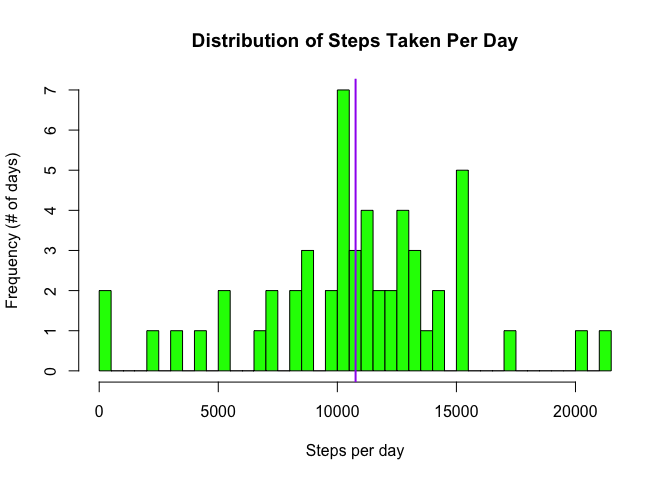
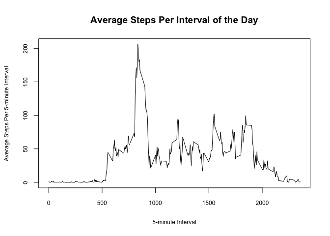
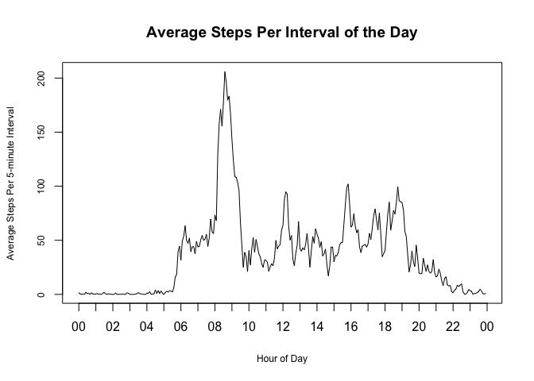
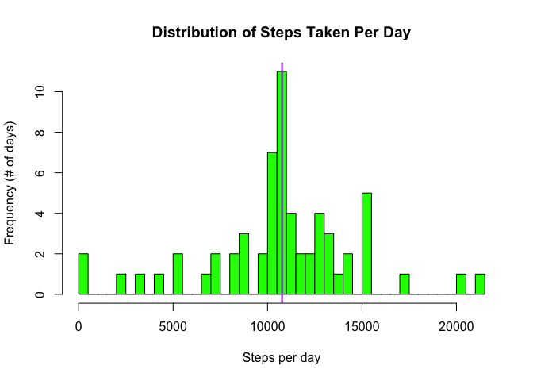
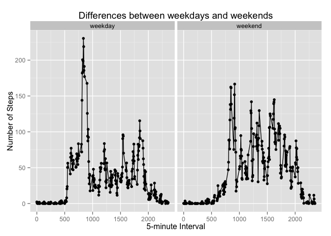

# Reproducible Research: Peer Assessment 1
<br>

## Loading and preprocessing the data

Note: set the working directory containing the activity.csv file before running the following R code.   

1. Load the data into R. A sample of the loaded data is included.

```r
data <- read.csv("activity.csv")
data[1:10, ]
```

```
##    steps       date interval
## 1     NA 2012-10-01        0
## 2     NA 2012-10-01        5
## 3     NA 2012-10-01       10
## 4     NA 2012-10-01       15
## 5     NA 2012-10-01       20
## 6     NA 2012-10-01       25
## 7     NA 2012-10-01       30
## 8     NA 2012-10-01       35
## 9     NA 2012-10-01       40
## 10    NA 2012-10-01       45
```

2. Process/transform the data. The date and interval columns were combined to form a new column called datetime. A sample of the transformed data is included.

```r
data <- transform(data, steps = steps, date = date, interval = interval, datetime = strptime(paste(date, sprintf("%04d",interval)), "%Y-%m-%d %H%M"))
data[1:10, ]
```

```
##    steps       date interval            datetime
## 1     NA 2012-10-01        0 2012-10-01 00:00:00
## 2     NA 2012-10-01        5 2012-10-01 00:05:00
## 3     NA 2012-10-01       10 2012-10-01 00:10:00
## 4     NA 2012-10-01       15 2012-10-01 00:15:00
## 5     NA 2012-10-01       20 2012-10-01 00:20:00
## 6     NA 2012-10-01       25 2012-10-01 00:25:00
## 7     NA 2012-10-01       30 2012-10-01 00:30:00
## 8     NA 2012-10-01       35 2012-10-01 00:35:00
## 9     NA 2012-10-01       40 2012-10-01 00:40:00
## 10    NA 2012-10-01       45 2012-10-01 00:45:00
```
<br>

## What is mean total number of steps taken per day?

1. Calculate the total number of steps taken per day.

```r
library(dplyr)
```

```
## 
## Attaching package: 'dplyr'
## 
## The following object is masked from 'package:stats':
## 
##     filter
## 
## The following objects are masked from 'package:base':
## 
##     intersect, setdiff, setequal, union
```

```r
byDate <- group_by(data, date)
stepsByDate <- summarise(byDate, steps = sum(steps))
data.frame(stepsByDate)
```

```
##          date steps
## 1  2012-10-01    NA
## 2  2012-10-02   126
## 3  2012-10-03 11352
## 4  2012-10-04 12116
## 5  2012-10-05 13294
## 6  2012-10-06 15420
## 7  2012-10-07 11015
## 8  2012-10-08    NA
## 9  2012-10-09 12811
## 10 2012-10-10  9900
## 11 2012-10-11 10304
## 12 2012-10-12 17382
## 13 2012-10-13 12426
## 14 2012-10-14 15098
## 15 2012-10-15 10139
## 16 2012-10-16 15084
## 17 2012-10-17 13452
## 18 2012-10-18 10056
## 19 2012-10-19 11829
## 20 2012-10-20 10395
## 21 2012-10-21  8821
## 22 2012-10-22 13460
## 23 2012-10-23  8918
## 24 2012-10-24  8355
## 25 2012-10-25  2492
## 26 2012-10-26  6778
## 27 2012-10-27 10119
## 28 2012-10-28 11458
## 29 2012-10-29  5018
## 30 2012-10-30  9819
## 31 2012-10-31 15414
## 32 2012-11-01    NA
## 33 2012-11-02 10600
## 34 2012-11-03 10571
## 35 2012-11-04    NA
## 36 2012-11-05 10439
## 37 2012-11-06  8334
## 38 2012-11-07 12883
## 39 2012-11-08  3219
## 40 2012-11-09    NA
## 41 2012-11-10    NA
## 42 2012-11-11 12608
## 43 2012-11-12 10765
## 44 2012-11-13  7336
## 45 2012-11-14    NA
## 46 2012-11-15    41
## 47 2012-11-16  5441
## 48 2012-11-17 14339
## 49 2012-11-18 15110
## 50 2012-11-19  8841
## 51 2012-11-20  4472
## 52 2012-11-21 12787
## 53 2012-11-22 20427
## 54 2012-11-23 21194
## 55 2012-11-24 14478
## 56 2012-11-25 11834
## 57 2012-11-26 11162
## 58 2012-11-27 13646
## 59 2012-11-28 10183
## 60 2012-11-29  7047
## 61 2012-11-30    NA
```

2. Make a histogram of the total number of steps taken each day. The mean number of steps is indicated by the purple line.

```r
hist(stepsByDate$steps, col = "green", breaks = length(unique(stepsByDate$steps)), main = "Distribution of Steps Taken Per Day", xlab = "Steps per day", ylab = "Frequency (# of days)")
abline(v = mean(stepsByDate$steps, na.rm = TRUE), col = "purple", lwd = 2)
```

 

3. Calculate the mean and median of the total number of steps taken per day.

```r
mean(stepsByDate$steps, na.rm = TRUE)
```

```
## [1] 10766.19
```

```r
median(stepsByDate$steps, na.rm = TRUE)
```

```
## [1] 10765
```
<br>

## What is the average daily activity pattern?

1. Make a time series plot (type = "l") of the 5-minute interval (x-axis) and the average number of steps taken, averaged across all days (y-axis).

```r
byInterval <- group_by(data, interval)
meanStepsByInterval <- summarise(byInterval, mean_steps = mean(steps, na.rm = TRUE))
with(meanStepsByInterval, plot(interval, mean_steps, type = "l", col = "black", main = "Average Steps Per Interval of the Day", xlab = "5-minute Interval", ylab = "Average Steps Per 5-minute Interval", cex.lab = 0.75, cex.axis = 0.75))
```

 
  
The same plot is generated below but with the x-axis in hours rather than 5-minute intervals, making it easier to see what part of the day most steps are taken.

```r
byInterval <- group_by(data, time = as.POSIXct(strftime(data$datetime, format="%H:%M"), format="%H:%M"))
meanStepsByInterval <- summarise(byInterval, mean_steps = mean(steps, na.rm = TRUE))
with(meanStepsByInterval, {plot(time, mean_steps, type = "l", col = "black",
 main = "Average Steps Per Interval of the Day", xlab = "Hour of Day", ylab = "Average Steps Per 5-minute Interval", cex.lab = 0.75, cex.axis = 0.75, xaxt = "n")
r <- as.POSIXct(round(range(time), "hours"))
axis.POSIXct(1, at = seq(r[1], r[2], by = "hour"), format = "%H")})
```

 

2. Which 5-minute interval, on average across all the days in the dataset, contains the maximum number of steps?

```r
byInterval <- group_by(data, interval)
meanStepsByInterval <- summarise(byInterval, mean_steps = mean(steps, na.rm = TRUE))
meanStepsByInterval[with(meanStepsByInterval, order(-mean_steps)), ]$interval[1]
```

```
## [1] 835
```
<br>

## Inputting missing values

1. Calculate the total number of missing values in the dataset (i.e. the total number of rows with NAs).

```r
sum(is.na(data$steps))
```

```
## [1] 2304
```

2. Create a new dataset that is equal to the original dataset but with the missing data filled in. The method used was to fill in NAs with the mean for that 5-minute interval, across all days. A sample of the new dataset is included. A new column, newSteps, contains filled in steps where previously missing.

```r
byInterval <- group_by(data, interval)
meanStepsByInterval <- summarise(byInterval, mean_steps = mean(steps, na.rm = TRUE))
mergedData <- merge(data, meanStepsByInterval, by = "interval")
mergedData <- mergedData[with(mergedData, order(datetime)), ]
newData <- within(mergedData, newSteps <- ifelse(!is.na(steps), steps, mean_steps))
newData[1:10, ]
```

```
##     interval steps       date            datetime mean_steps  newSteps
## 1          0    NA 2012-10-01 2012-10-01 00:00:00  1.7169811 1.7169811
## 63         5    NA 2012-10-01 2012-10-01 00:05:00  0.3396226 0.3396226
## 128       10    NA 2012-10-01 2012-10-01 00:10:00  0.1320755 0.1320755
## 205       15    NA 2012-10-01 2012-10-01 00:15:00  0.1509434 0.1509434
## 264       20    NA 2012-10-01 2012-10-01 00:20:00  0.0754717 0.0754717
## 327       25    NA 2012-10-01 2012-10-01 00:25:00  2.0943396 2.0943396
## 376       30    NA 2012-10-01 2012-10-01 00:30:00  0.5283019 0.5283019
## 481       35    NA 2012-10-01 2012-10-01 00:35:00  0.8679245 0.8679245
## 495       40    NA 2012-10-01 2012-10-01 00:40:00  0.0000000 0.0000000
## 552       45    NA 2012-10-01 2012-10-01 00:45:00  1.4716981 1.4716981
```

3. Create a histogram of the total number of steps taken each day and calculate the mean and median total number of steps taken per day. Do these values differ from the estimates from the first part of the assignment? What is the impact of inputing missing data on the estimates of the total daily number of steps?

```r
byDate <- group_by(newData, date)
stepsByDate <- summarise(byDate, newSteps = sum(newSteps))
hist(stepsByDate$newSteps, col = "green", breaks = length(unique(stepsByDate$newSteps)), main = "Distribution of Steps Taken Per Day", xlab = "Steps per day",
 ylab = "Frequency (# of days)")
abline(v = mean(stepsByDate$newSteps, na.rm = TRUE), col = "purple", lwd = 2)
```

 

```r
mean(stepsByDate$newSteps, na.rm = TRUE)
```

```
## [1] 10766.19
```

```r
median(stepsByDate$newSteps, na.rm = TRUE)
```

```
## [1] 10766.19
```
  
**Comments:**  
After filling in the missing data, the mean is the same as before, while the median increased by a step per day (see comparison below). Filling in the missing data doesn't have a significant impact on the mean and median.
  
**Mean**  
before: 10766.19  
after:  10766.19    
**Median**  
before: 10765  
after: 10766.19  
<br>

## Are there differences in activity patterns between weekdays and weekends?


1. Create a new factor variable in the dataset with two levels – “weekday” and “weekend” indicating whether a given date is a weekday or weekend day. A sample of the revised data is included.

```r
newData$day_of_week <- weekdays(newData[ , "datetime"])
newData$day_of_week[grep("^S", newData$day_of_week)] <- "weekend"
newData$day_of_week[grep("^[^week]", newData$day_of_week)] <- "weekday"
newData[0:10, ]        
```

```
##     interval steps       date            datetime mean_steps  newSteps
## 1          0    NA 2012-10-01 2012-10-01 00:00:00  1.7169811 1.7169811
## 63         5    NA 2012-10-01 2012-10-01 00:05:00  0.3396226 0.3396226
## 128       10    NA 2012-10-01 2012-10-01 00:10:00  0.1320755 0.1320755
## 205       15    NA 2012-10-01 2012-10-01 00:15:00  0.1509434 0.1509434
## 264       20    NA 2012-10-01 2012-10-01 00:20:00  0.0754717 0.0754717
## 327       25    NA 2012-10-01 2012-10-01 00:25:00  2.0943396 2.0943396
## 376       30    NA 2012-10-01 2012-10-01 00:30:00  0.5283019 0.5283019
## 481       35    NA 2012-10-01 2012-10-01 00:35:00  0.8679245 0.8679245
## 495       40    NA 2012-10-01 2012-10-01 00:40:00  0.0000000 0.0000000
## 552       45    NA 2012-10-01 2012-10-01 00:45:00  1.4716981 1.4716981
##     day_of_week
## 1       weekday
## 63      weekday
## 128     weekday
## 205     weekday
## 264     weekday
## 327     weekday
## 376     weekday
## 481     weekday
## 495     weekday
## 552     weekday
```

2. Create a panel plot containing a time series plot (type = "l") of the 5-minute interval (x-axis) and the average number of steps taken, averaged across all weekday days or weekend days (y-axis).

```r
byDayType <- group_by(newData, day_of_week, interval)
stepsByDayType <- summarise(byDayType, steps = mean(newSteps))
        
library(ggplot2)
g <- ggplot(stepsByDayType, aes(interval, steps))
g + geom_point() + geom_line() + facet_grid(. ~ day_of_week) + labs(title = "Differences between weekdays and weekends") + labs(x = "5-minute Interval") + labs(y = "Number of Steps")
```

 

**Comments:**  
The plots indicate that activity starts a little earlier on weekdays (above 50 steps by interval 600) versus weekends (below 25 steps by interval 600) and that activity peaks higher on weekdays (over 225 steps by interval 850) versus weekends (under 175 steps by interval 900). However, almost 2000 more total daily steps are taken on the average weekend day versus weekday, as indicated below.


```r
byDayType <- group_by(newData, day_of_week, date)
stepsByDayType <- summarise(byDayType, steps = sum(newSteps))
byDayType2 <- group_by(stepsByDayType, day_of_week)
summarise(byDayType2, average_total_steps = mean(steps))
```

```
## Source: local data frame [2 x 2]
## 
##   day_of_week average_total_steps
## 1     weekday            10255.85
## 2     weekend            12201.52
```
